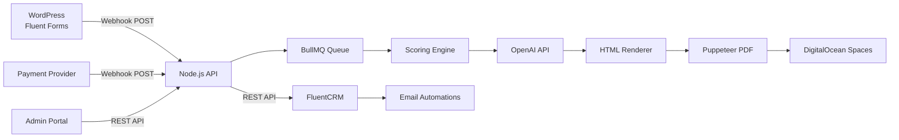
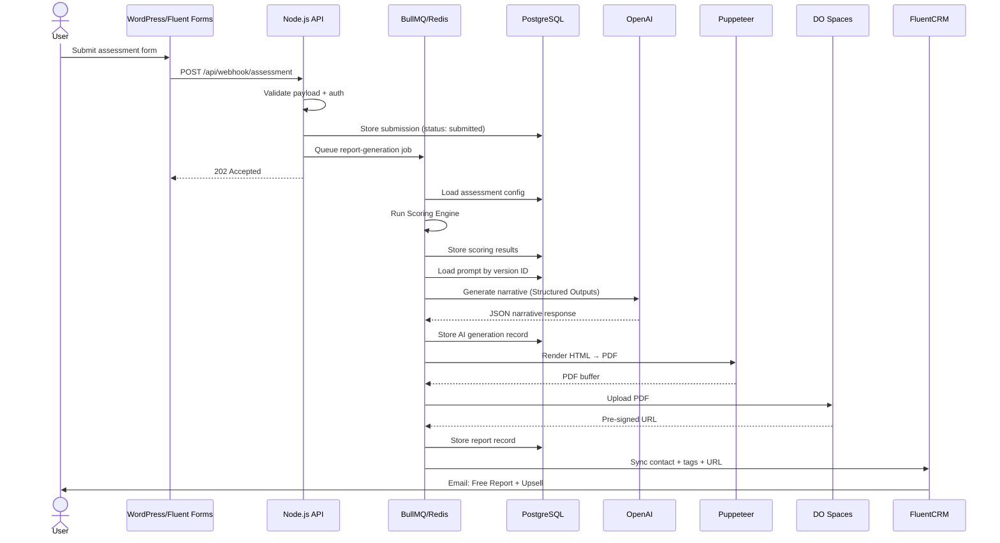
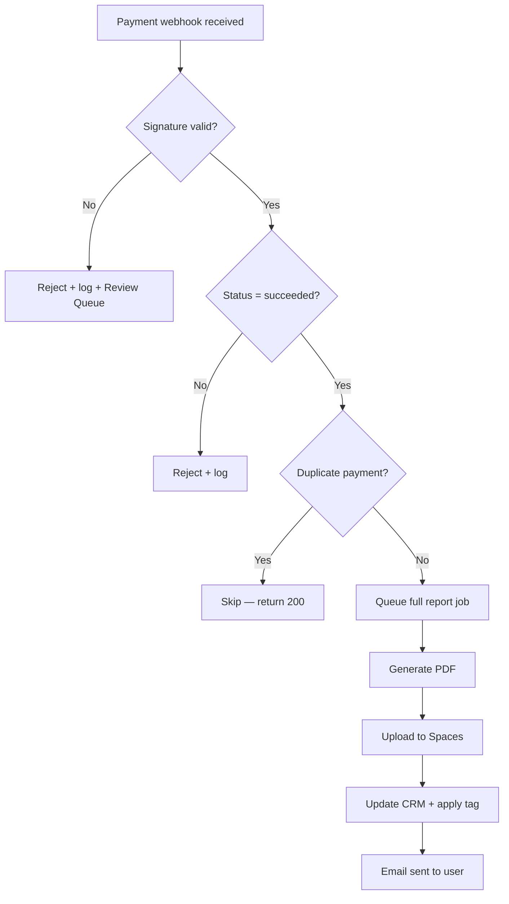

# Application Flow — How the Platform Works

This document traces every user journey and system interaction from start to finish.

---

## High-Level System Diagram



---

## Flow 1: Free Report — User Completes Assessment

This is the main flow. A user fills out a form and receives a free 1-page report.

### Step-by-Step

```
STEP 1 — User opens WordPress page
├── User sees the Fluent Forms assessment form
├── Form contains N questions (Likert scale, multiple choice, etc.)
└── User fills in: first name, last name, email, consent checkbox, all answers

STEP 2 — User clicks Submit
├── Fluent Forms validates the form client-side
├── On success, Fluent Forms fires a POST webhook to:
│     POST https://api.yourdomain.com/api/webhook/assessment
│     Headers: Authorization: Bearer <WEBHOOK_BEARER_TOKEN>
│     Body: { assessment_key, user_email, first_name, last_name, consent_status, question_1...question_N }
└── User sees a "Thank you" confirmation page on WordPress

STEP 3 — API receives the webhook
├── Express route: POST /api/webhook/assessment
├── Middleware checks Bearer token → reject 401 if invalid
├── Zod schema validates payload structure:
│   ├── assessment_key present and valid? → else 400
│   ├── email format valid? → else 400
│   ├── consent_status === true? → else 400
│   └── all required question fields present? → else 400
├── If validation fails:
│   ├── Log rejected payload to `webhook_logs` table
│   ├── Surface in Admin Review Queue
│   └── Return 400 with error details
└── If validation passes → continue to Step 4

STEP 4 — Submission stored in database
├── INSERT INTO `submissions` table:
│   ├── id (UUID)
│   ├── assessment_key
│   ├── user_email, first_name, last_name
│   ├── raw_payload (full JSON for audit)
│   ├── status = 'submitted'
│   └── created_at
└── Return 202 Accepted to Fluent Forms (async processing)

STEP 5 — Job queued in BullMQ
├── Add job to `report-generation` queue:
│   ├── job data: { submission_id, report_type: 'free' }
│   ├── attempts: 3
│   └── backoff: exponential (5s, 10s, 20s)
└── Job enters 'waiting' state in Redis

STEP 6 — Worker picks up the job
├── BullMQ worker dequeues the job
├── UPDATE submission SET status = 'processing'
├── Load assessment config from `assessment_configs` table by assessment_key:
│   ├── dimensions (subscale definitions)
│   ├── question_map (which question → which dimension)
│   ├── weights (per-question scoring weight)
│   ├── reverse_scored (question IDs to invert)
│   ├── score_bands (ranges → labels)
│   ├── recommendation_rules
│   ├── prompt_version_id (which AI prompt to use)
│   ├── template_id (which HTML template)
│   ├── brand_id (which brand config)
│   └── chart_config (chart types per section)
└── Pass to Scoring Engine

STEP 7 — Scoring Engine runs
├── For each question in submission:
│   ├── Look up dimension from question_map
│   ├── Apply weight from weights config
│   ├── If question is in reverse_scored → invert value (e.g., 5 becomes 1)
│   └── Add to dimension running total
├── Calculate:
│   ├── total_score (sum of all weighted values)
│   ├── subscale_scores (per-dimension totals)
│   ├── score_bands (map each subscale to band label via score_bands config)
│   ├── recommendation_category (apply recommendation_rules logic)
│   └── pattern_flags (detect notable cross-dimension patterns)
├── Store scoring output as JSON in `scoring_results` table
└── Pass structured scoring output to AI Engine

STEP 8 — AI Narrative Engine generates content
├── Load active prompt from `prompts` table by prompt_version_id
│   └── This is the FREE REPORT prompt
├── Build OpenAI API request:
│   ├── model: "gpt-4o"
│   ├── response_format: { type: "json_schema", schema: FreeReportSchema }
│   ├── system message: the loaded prompt text
│   └── user message: structured scoring output + user first name
├── Call OpenAI API
├── Validate response matches JSON schema (Structured Outputs enforces this)
├── Store AI output in `ai_generations` table:
│   ├── prompt_version_id used
│   ├── model_name
│   ├── generation_timestamp
│   ├── token_count
│   └── response_time_ms
└── Return structured narrative JSON

STEP 9 — HTML Report rendered
├── Load brand config from `brands` table by brand_id:
│   ├── logo URL, primary/secondary colours
│   ├── CTA button labels + URLs
│   └── Footer / disclaimer text
├── Load HTML template: template_free.html for this brand
├── Inject dynamic data via template engine (Handlebars/EJS):
│   ├── User name
│   ├── Scores + band labels
│   ├── AI narrative sections (summary, strengths, etc.)
│   ├── Brand colours via CSS variables
│   ├── Brand logo
│   └── CTA buttons with brand-specific URLs
└── Rendered HTML string ready for Puppeteer

STEP 10 — Puppeteer generates PDF
├── Launch headless Chromium
├── Load rendered HTML into page
├── Wait for all chart blocks to render (if any in free report)
├── Print to PDF with configured dimensions + margins
├── Save PDF buffer
└── Close browser instance

STEP 11 — PDF uploaded to DigitalOcean Spaces
├── Upload PDF to Spaces bucket:
│   └── Key: reports/{submission_id}/free_v{version}.pdf
├── Generate pre-signed URL with expiry (default 7 days)
├── Store in `reports` table:
│   ├── submission_id
│   ├── report_type = 'free'
│   ├── report_version = 1
│   ├── storage_key
│   ├── signed_url
│   ├── signed_url_expires_at
│   ├── prompt_version_id
│   ├── template_version
│   ├── brand_id
│   └── scoring_config_snapshot (JSON)
└── UPDATE submission SET status = 'generated'

STEP 12 — FluentCRM synced
├── Call FluentCRM REST API:
│   POST /wp-json/fluent-crm/v2/subscribers
│   (or PUT to update existing contact)
├── Set custom fields:
│   ├── assessment_name
│   ├── last_assessment_date
│   ├── total_score
│   ├── primary_band
│   ├── report_type = 'free'
│   ├── recommendation
│   └── free_report_url = pre-signed URL
├── Apply tags:
│   ├── assessment-completed
│   ├── free-report-ready
│   ├── paid-report-ready (enables upsell sequence)
│   └── Conditional: free-talk-invite / program-recommended / therapy-recommended
├── Log CRM sync result in `crm_sync_logs`
└── UPDATE submission SET status = 'sent'

STEP 13 — FluentCRM triggers emails
├── assessment-completed tag → Thank-you email (immediate)
├── free-report-ready tag → Free Report Delivery email
│   └── Contains: pre-signed download link to PDF
├── paid-report-ready tag → Upsell email sequence begins
│   └── "Unlock your Full Report for $5.00" with payment link
└── Conditional tags trigger additional sequences (free talk, program, therapy)
```

### Flow Diagram



---

## Flow 2: Full Report — Paid Purchase

User receives the upsell email, pays $5, and gets the full 3-page report.

```
STEP 1 — User receives upsell email
├── FluentCRM sends email triggered by `paid-report-ready` tag
├── Email contains a payment link (Stripe Checkout / PayPal / etc.)
└── User clicks the link → redirected to payment page

STEP 2 — User completes $5.00 payment
├── Payment processed by provider (e.g., Stripe)
└── Payment provider fires webhook to API

STEP 3 — Payment webhook received
├── POST /api/webhook/payment
├── Verify webhook signature (HMAC):
│   ├── Invalid signature → log + reject + surface in Review Queue
│   └── Valid → continue
├── Check payment_status === "succeeded":
│   ├── Not succeeded → log + reject
│   └── Succeeded → continue
├── Check for duplicate payment (idempotency key):
│   ├── Duplicate → log + skip (return 200)
│   └── New → continue
├── Look up submission by payment metadata (email / submission_id)
├── Store payment record in `payments` table
└── Queue full report generation job

STEP 4 — Full report generated
├── Same pipeline as free report Steps 6–11
├── Uses FULL REPORT prompt (loaded by prompt_version_id from config)
├── Uses template_full.html (3-page template)
├── Generates all 12 sections with modular chart blocks
├── PDF uploaded to Spaces: reports/{submission_id}/full_v{version}.pdf
└── Pre-signed URL generated and stored

STEP 5 — FluentCRM updated
├── Set custom field: full_report_url = pre-signed URL
├── Set custom field: report_type = 'full'
├── Apply tag: full-report-delivered
│   └── ONLY after: confirmed payment + PDF generated + URL stored
└── FluentCRM triggers "Full Report Ready" email with download link

STEP 6 — User receives full report email
└── User downloads the 3-page PDF via pre-signed URL
```

### Safety Rules Enforced



---

## Flow 3: Admin Portal — Core Operations

### 3A. Admin Login

```
1. Admin navigates to https://api.yourdomain.com/admin
2. Enters email + password
3. API validates credentials → bcrypt compare
4. On success → JWT issued (stored in httpOnly cookie or localStorage)
5. Admin redirected to Dashboard
```

### 3B. Assessment Config Management

```
VIEW ALL ASSESSMENTS
├── GET /api/admin/assessments
├── Table: assessment name, brand, status (active/draft), last modified
└── Click any row → opens config editor

EDIT ASSESSMENT CONFIG
├── GET /api/admin/assessments/:id
├── Editable fields:
│   ├── dimensions (add/remove/rename subscales)
│   ├── question_map (assign questions to dimensions)
│   ├── weights (set per-question weight)
│   ├── reverse_scored (toggle reverse scoring)
│   ├── score_bands (set ranges for Low/Moderate/High)
│   ├── recommendation_rules (conditional logic editor)
│   ├── prompt_version_id (dropdown: select from available versions)
│   ├── template_id (dropdown: select from templates)
│   ├── brand_id (dropdown: select from brands)
│   └── chart_config (select chart type per report section)
├── PUT /api/admin/assessments/:id
└── Changes saved → no deployment needed

CLONE ASSESSMENT
├── POST /api/admin/assessments/:id/clone
├── Creates full duplicate with new name
├── All configs duplicated: dimensions, weights, rules, prompts, template, brand
├── Admin edits any field of the clone
├── Audit trail: clone_origin, cloned_by, cloned_at
└── Activate when ready
```

### 3C. Prompt Manager

```
VIEW PROMPTS
├── GET /api/admin/prompts
├── List: Free Report, Full Report, Recommendation, Brand Tone
└── Each shows: active version number, last edited, edited by

EDIT PROMPT
├── GET /api/admin/prompts/:type
├── Rich text editor with current active version loaded
├── "Save as Draft" → creates new version with status = 'draft'
├── "Activate" → sets this version as active
│   └── Only active version is used by the AI engine
├── "Rollback" → activate any prior version
├── Version history sidebar:
│   ├── Version number
│   ├── Created timestamp
│   ├── Created by (admin user)
│   ├── Change notes
│   └── Status: draft / active / archived
└── "Linked Assessments" tab → shows which assessments use this version
```

### 3D. Brand Management

```
VIEW BRANDS
├── GET /api/admin/brands
├── Card grid: brand name, logo preview, colour swatch
└── Click → opens brand editor

EDIT BRAND
├── GET /api/admin/brands/:id
├── Upload logo (PNG/SVG) → stored in Spaces
├── Set primary colour, secondary colour (hex picker)
├── Set CTA button labels (array of label strings)
├── Set CTA URLs (array of destination URLs)
├── Set footer/disclaimer text
├── Set contact details
├── Set brand tone prompt (optional — injected into AI generation)
├── PUT /api/admin/brands/:id
└── After save: existing reports can be regenerated under new brand
```

### 3E. Client & Reports Backend

```
SEARCH CLIENTS
├── GET /api/admin/clients?search=&filter=&dateFrom=&dateTo=
├── Filters: name, email, assessment, brand, date range, report status
└── Table: name, email, assessment, submission date, report status

VIEW CLIENT RECORD
├── GET /api/admin/clients/:id
├── Shows:
│   ├── All submissions across all assessments
│   ├── Per submission: all reports with version history
│   ├── Per report: status lifecycle (submitted → processing → generated → sent)
│   ├── Prompt version + template version used
│   ├── CRM sync status
│   ├── Raw incoming payload (expandable)
│   └── Current + prior report PDFs
├── Actions:
│   ├── "Refresh Link" → generate new pre-signed URL for expired report
│   ├── "Regenerate Report" → opens regeneration dialog (see Flow 4)
│   └── "View in CRM" → deep link to FluentCRM contact
```

### 3F. Review Queue & Logs

```
VIEW REVIEW QUEUE
├── GET /api/admin/review-queue?type=&status=&dateFrom=&dateTo=
├── Item types: failed_job, rejected_webhook, regeneration, ai_error, delivery_failure, payment_issue
├── Each item shows:
│   ├── Type, timestamp, assessment, brand
│   ├── Error message + stack trace (expandable)
│   ├── Raw payload (expandable)
│   └── Status: new / reviewed / resolved
├── Actions:
│   ├── "Reprocess" → re-queue the failed job
│   ├── "Mark Reviewed" → with optional note
│   └── "Export" → download logs as CSV/JSON
```

---

## Flow 4: Report Regeneration

```
TRIGGER: Admin clicks "Regenerate" on a client's report

1. Admin selects scope:
   ├── Free report only
   ├── Full report only
   └── Both

2. Admin selects config to apply:
   ├── Current active config (latest prompt, template, brand, scoring)
   └── A specific prior version

3. Admin enters regeneration reason (required text field)

4. Admin clicks "Confirm Regeneration"
   ├── POST /api/admin/reports/:id/regenerate
   ├── Body: { scope, config_version, reason }
   └── API queues regeneration job in BullMQ

5. Regeneration job runs:
   ├── Re-score using selected scoring config
   ├── Re-generate AI narrative using selected prompt version
   ├── Re-render HTML with selected template + brand
   ├── Re-generate PDF via Puppeteer
   ├── Upload new PDF to Spaces (new key — old version NOT overwritten)
   ├── Generate new pre-signed URL
   ├── Store new report version:
   │   ├── report_version incremented
   │   ├── prompt_version_id
   │   ├── template_version
   │   ├── brand_id
   │   ├── scoring_config_snapshot
   │   ├── regenerated_at
   │   ├── regeneration_reason
   │   └── regeneration_count++
   └── Prior version retained in report_versions table

6. Optionally update CRM:
   ├── Admin checkbox: "Update CRM with new URL?"
   ├── If yes → FluentCRM contact updated with new signed URL
   └── If no → CRM retains old URL (admin's choice)
```

---

## Flow 5: Error Handling & Retry

```
SCENARIO: Any step in the pipeline fails

1. BullMQ catches the error
2. If attempts < max_retries (default 3):
   ├── Job re-queued with exponential backoff
   │   ├── Attempt 1: wait 5s
   │   ├── Attempt 2: wait 10s
   │   └── Attempt 3: wait 20s
   └── Retry logged
3. If all retries exhausted:
   ├── Job marked as 'failed'
   ├── submission status updated to 'failed'
   ├── Error details logged:
   │   ├── Error message + stack trace
   │   ├── Which step failed (scoring / AI / PDF / upload / CRM)
   │   └── Full job data
   ├── Item surfaced in Admin Review Queue
   └── Admin can "Reprocess" from Review Queue at any time

SPECIFIC FAILURE SCENARIOS:

OpenAI API failure:
├── Timeout → retry with backoff
├── Rate limit → retry with backoff
├── Schema validation fail → log + fail (don't retry — prompt issue)
└── Surfaced in Review Queue with full error

Puppeteer failure:
├── Crash → retry
├── Timeout → retry
└── Out of memory → log + fail + admin alert

CRM sync failure:
├── Network error → retry
├── Auth error → fail + log (credentials may be invalid)
└── Report still generated — CRM sync is a separate step

Spaces upload failure:
├── Network error → retry
├── Permission error → fail + log
└── PDF held in memory until successful upload
```

---

## API Endpoint Summary

| Method | Path | Purpose | Auth |
|--------|------|---------|------|
| POST | `/api/webhook/assessment` | Receive Fluent Forms submission | Bearer token |
| POST | `/api/webhook/payment` | Receive payment confirmation | Signature verification |
| POST | `/api/admin/auth/login` | Admin login | Public |
| GET | `/api/admin/assessments` | List all assessments | JWT |
| GET | `/api/admin/assessments/:id` | Get assessment config | JWT |
| PUT | `/api/admin/assessments/:id` | Update assessment config | JWT |
| POST | `/api/admin/assessments/:id/clone` | Clone assessment | JWT |
| GET | `/api/admin/prompts` | List all prompt types | JWT |
| GET | `/api/admin/prompts/:type` | Get prompt with versions | JWT |
| PUT | `/api/admin/prompts/:type` | Save prompt version | JWT |
| POST | `/api/admin/prompts/:type/activate` | Activate prompt version | JWT |
| GET | `/api/admin/brands` | List all brands | JWT |
| GET | `/api/admin/brands/:id` | Get brand config | JWT |
| PUT | `/api/admin/brands/:id` | Update brand config | JWT |
| POST | `/api/admin/brands` | Create new brand | JWT |
| GET | `/api/admin/clients` | Search/filter clients | JWT |
| GET | `/api/admin/clients/:id` | Client record detail | JWT |
| POST | `/api/admin/reports/:id/regenerate` | Regenerate a report | JWT |
| POST | `/api/admin/reports/:id/refresh-url` | Refresh pre-signed URL | JWT |
| GET | `/api/admin/review-queue` | List review queue items | JWT |
| POST | `/api/admin/review-queue/:id/reprocess` | Reprocess failed item | JWT |
| PUT | `/api/admin/review-queue/:id/resolve` | Mark item resolved | JWT |
| GET | `/api/admin/logs` | View system logs | JWT |
| GET | `/api/admin/dashboard` | Dashboard stats | JWT |
